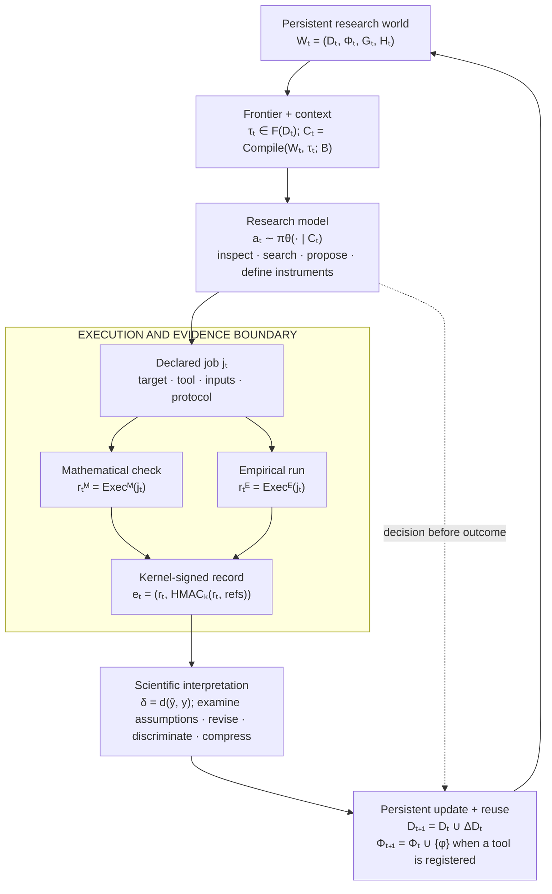

# Recursive Discovery

[](https://github.com/vidal-llaurado/recursive-discovery/releases)
[](https://www.python.org/)
[](LICENSE)

[Quick start](#quick-start) · [The kernel](#the-kernel) · [Formalism](docs/FORMALISM.md) · [Usage](docs/USAGE.md) · [Changelog](CHANGELOG.md)

Recursive Discovery is a research system for scientific problems that need both mathematical reasoning and empirical evidence. A model chooses what to investigate; external tools run formal checks and experimental protocols; a persistent graph records the proposals, observations, and relationships between them.

A result can also become a representation, a named concept, or a callable instrument that later work inherits, so the system accumulates reusable resources as it runs.

## Quick start

From the extracted or cloned repository:

```bash
python -m venv .venv
source .venv/bin/activate
python -m pip install -e .

recursive-discovery init ./research-workspace
recursive-discovery status ./research-workspace
recursive-discovery tools ./research-workspace
```

These commands assume a POSIX environment. See [Usage](docs/USAGE.md#install) for platform and optional-backend requirements.

Create a study and retain the printed artifact ID:

```python
from recursive_discovery import open_project

project = open_project("./research-workspace")
try:
    study = project.ledger.put(
        "study",
        {"question": "Your research question", "scope": "Your assumptions and constraints"},
        by="human",
    )
    print(study.id)
finally:
    project.close()
```

A study on its own produces no executable frontier work. Start an exploratory session to propose the first claims or experiments, then use the frontier runner:

```bash
recursive-discovery research-step ./research-workspace STUDY_ID \
  --model-cmd "python model_bridge.py"

recursive-discovery run ./research-workspace \
  --model-cmd "python model_bridge.py"

recursive-discovery trace ./research-workspace
recursive-discovery report ./research-workspace --out ./research-report.md
```

`STUDY_ID` is the ID printed above. **`model_bridge.py` is your adapter**: it reads one JSON request from stdin and returns one JSON response on stdout. Model credentials and the provider SDK stay outside this package. See [Usage](docs/USAGE.md) for the request contract, resuming work, instruments, and execution setup.

## The kernel

The kernel is the component of the system that should remain understandable as models and instruments become more capable.

| Element | Responsibility | Implementation |
| :--- | :--- | :--- |
| **Artifact** | Give a proposal, result, instrument, or decision a content-derived identity and typed references. | [`Artifact`](src/recursive_discovery/core.py) |
| **Ledger** | Retain scientific state and its lineage. Operational projects use SQLite and content-addressed files. | [`SQLiteLedger`, `BlobStore`](src/recursive_discovery/store.py) |
| **Execution kernel** | Run a declared tool, capture its outcome and provenance, and sign the execution record. | [`Kernel`](src/recursive_discovery/core.py), [`WorkerKernel`](src/recursive_discovery/worker.py) |
| **Frontier** | Derive pending work from missing records and relationships: a claim needs a check; an experiment needs a run; a discrepancy needs investigation. | [`frontier`](src/recursive_discovery/core.py) |
| **Promotion** | Record an abstraction as a basis for a subsequent research world. | [`compress`, `promote`](src/recursive_discovery/core.py) |

For a declared job $j$, an execution produces a record $r$. The kernel attaches an authentication tag to the record and its references:

$$
 r=\operatorname{Exec}(j),\qquad
 e=(r,\operatorname{HMAC}_k(r,\text{references})).
$$

Here $j$ identifies the target, tool, declared inputs, and execution settings. The record includes the exit status, output, input digests, and runtime metadata. The signature attests to that record under the kernel's key.

Protecting the signing key, evaluator credentials, and execution environment requires deployment isolation. See [Security](SECURITY.md).

## How a research cycle works

Let $D_t=(\mathcal A_t,\mathcal R_t)$ denote the artifact graph, $\Phi_t$ its callable instruments, $G_t$ its concept grammar, and $\mathcal H_t$ its decision history. Together they form the research world $W_t$.



*Figure 1. The model selects actions; the execution layer returns records; interpretation creates further work or reusable artifacts. Both evidence streams share one ledger.*

A mathematical check supports a formal statement under stated assumptions. An empirical run measures an outcome under a protocol. The ledger keeps the two separate: a failed process, an out-of-scope observation, and a refuted claim are three different outcomes, and none of them establishes the others.

## What makes it recursive

A stored result becomes reusable infrastructure when later work can build on it. There are three routes:

| Route | Operation | What later research inherits |
| :--- | :--- | :--- |
| **Instrument** | $\phi:X\to Z$, then $\Phi_{t+1}=\Phi_t\cup\{\phi\}$ | A callable transformation from inputs to a diagnostic. |
| **Concept** | $G_{n+1}=G_n\cup\{m_n\}$ | A named composite that can be used in later program search. |
| **Research world** | $W_{t+1}=W_t\oplus b_t$ | An explicit basis: a representation, invariant, or working mechanism. |

A model can define a numerical instrument during a session, check it against declared interface cases, and call it on a later turn. Definitions persist across workbench instances.

The fuller operator language—including assumption stress tests, hypothesis discrimination, representation diagnostics, and grammar extension—is specified in [Formalism](docs/FORMALISM.md#scientific-transformations).

## Context management

The model receives a task-local context, not the entire history:

$$
 C_t=\mathcal C(W_t,\tau_t;B).
$$

The compiler combines graph traversal, lexical retrieval, authority labels, and payload clipping. Its capacity settings control context size; frontier selection uses the model's judgment.

Within a session, the model can inspect artifacts, search locally or in the literature, call instruments, define a diagnostic, write a *memo*, and activate several candidate branches. Evidence and branch records receive higher type-priority weights than memos.

Decisions and outcomes are separate records:

$$
 d_j=(\operatorname{hash}(s_j),a_j,\text{payload}_j),\qquad
 o_j\longrightarrow d_j,\qquad
 \mathcal H_t=\{(d_j,o_j)\}_{j\leq t}.
$$

The lookup retrieves recorded outcomes by state digest and action name, which is what later replay work would build on. Its scope is specified in [Formalism](docs/FORMALISM.md#history-and-prospective-evaluation).

## What's included

| Surface | Included | Setup required |
| :--- | :--- | :--- |
| **Researcher** | Model-owned sessions, branches, memos, decision traces. | Supply a model bridge; no model is bundled. |
| **Mathematics** | Python and SymPy checks; Lean, Z3, and cvc5 adapters. | Install external solvers to use those adapters. |
| **Laboratory** | Declared-input snapshots, seeded runs, measurements, summaries, worker adapters. | Configure container execution for isolation. |
| **Workbench** | Symbolic algebra, falsification search, spectra, sensitivity, Hessians, dynamics, scaling, time series. | None. |
| **Literature** | arXiv, OpenAlex, Crossref, source reading, publication-date filters. | Network access for retrieval. |
| **Prospective evaluation** | Commitments, one-use test handles, a separate evaluator service. | Isolate secret bytes, credentials, and filesystem access. |

**What the surface list does not promise.** Running a check is not the same as its being correct: executable checks are not automatically formal proofs, tool success is not a theorem, and the default process worker is not a sandbox. [Security](SECURITY.md) covers the isolation you must supply, and [Formalism §2.2](docs/FORMALISM.md#22-authentication-not-a-theorem) covers what a signature does and does not attest.

The operational runtime automatically executes configured claim checks and experiment runs. Other frontier items require a model session or caller-supplied policy. Current execution is predominantly serial; persistent branches are not a distributed swarm.

An empty frontier means the implemented routing rules found no pending tasks, which is narrower than a research program being scientifically complete.

## Documentation

| Document | Purpose |
| :--- | :--- |
| [Formalism](docs/FORMALISM.md) | Notation, kernel semantics, scientific operators, and implementation qualifications. |
| [Design](docs/DESIGN.md) | Why strategy, interpretation, and tool growth remain outside the execution kernel. |
| [Usage](docs/USAGE.md) | Installation, model integration, project operation, and source map. |
| [References](docs/REFERENCES.md) | Annotated relationship to Buehler, SwarmWorld, and Dream-RSI. |
| [Security](SECURITY.md) | Execution isolation, signing keys, and prospective-data boundaries. |
| [Changelog](CHANGELOG.md) | Release history. |

Buehler's *Recursive Meta-Intelligence* supplied the original representation *to* instrument *to* world framing [1]. SwarmWorld informed the use of persistent artifacts and externally determined consequences [2]. Dream-RSI motivated explicit decision/outcome history [3]. This work combines those influences with separate mathematical and empirical channels; it does not reproduce the experiments or performance claims of the cited systems.

[1] Markus J. Buehler. [*Recursive Meta-Intelligence*](https://x.com/ProfBuehlerMIT/article/2099834306046664792). 2026.  
[2] Subhadeep Pal, Fiona Y. Wang, and Markus J. Buehler. [*SwarmWorld: Stigmergic technological evolution in societies of language-model agents*](https://arxiv.org/abs/2608.26081). 2026.  
[3] Tong Zheng et al. [*Dream-RSI: Recursive Self-Improvement through Evolving Worlds*](https://arxiv.org/abs/2609.14858). 2026.

---

**Release scope.** `v1.0.0` is the first public release: the general research machinery, without bundled demonstrations or frozen benchmark outputs. [Apache License 2.0](LICENSE).
